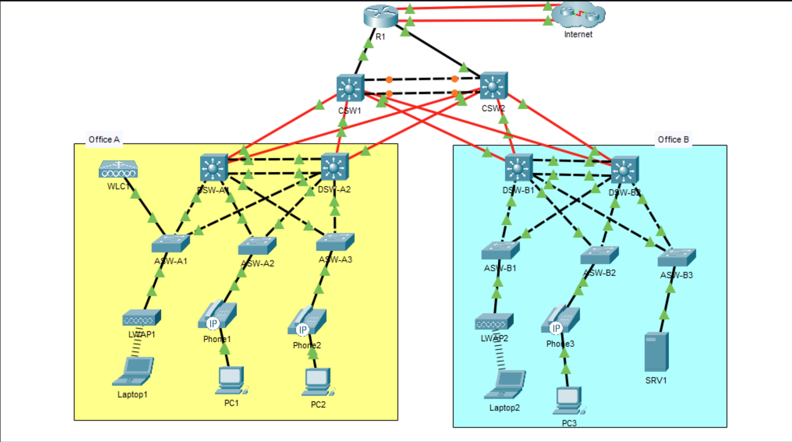

# CCNA Mega Lab — Full Walkthrough & Configuration Notes

My complete build notes for the **Jeremy's IT Lab CCNA Mega Lab** in Cisco Packet Tracer: an enterprise network with two offices, a collapsed core, redundant Layer 3, and pretty much every CCNA 200-301 topic stacked into one topology.

These are the notes I wish I'd had while doing it: every command, *why* it's there, the verification command to prove it worked, and the specific things that bit me along the way.

This lab was one of the core things that helped me secure the CCNA, so here are the in depth notes for it I've transferred from my **Obsidian** vault.

---

## What's in this network

| Domain | Technologies |
|---|---|
| Layer 2 | VLANs, 802.1Q trunking, DTP suppression, VTPv2, PAgP & LACP EtherChannel, Rapid PVST+, PortFast, BPDU Guard |
| Layer 3 | Static routing, floating static routes, OSPFv2 (single area), HSRPv2, Layer 3 EtherChannel, SVIs, inter-VLAN routing |
| Services | DHCP server + relay, DNS, NTP w/ authentication, SNMPv2c, Syslog, FTP (IOS upgrade), SSHv2, static NAT, dynamic PAT |
| Security | Named extended ACLs, standard ACLs, Port Security, DHCP Snooping, Dynamic ARP Inspection |
| IPv6 | Dual-stack addressing, EUI-64, `ipv6 enable`, static & floating default routes |
| Wireless | WLC dynamic interface, WPA2-PSK WLAN, LWAP association |
| Discovery | CDP disabled, LLDP enabled with selective Tx suppression |

---

## Topology



**Access switch uplinks:** every ASW uses `G0/1` → DSW-x1 and `G0/2` → DSW-x2.
**Access switch host port:** every ASW uses `F0/1`. ASW-A1 additionally uses `F0/2` for WLC1.

---

## Addressing plan

### Point-to-point routed links (all /30)

| Link | Subnet | Side A | Side B |
|---|---|---|---|
| R1 G0/0 ↔ CSW1 G1/0/1 | 10.0.0.32/30 | .33 (R1) | .34 (CSW1) |
| R1 G0/1 ↔ CSW2 G1/0/1 | 10.0.0.36/30 | .37 (R1) | .38 (CSW2) |
| CSW1 Po1 ↔ CSW2 Po1 | 10.0.0.40/30 | .41 (CSW1) | .42 (CSW2) |
| CSW1 G1/1/1 ↔ DSW-A1 G1/1/1 | 10.0.0.44/30 | .45 | .46 |
| CSW1 G1/1/2 ↔ DSW-A2 G1/1/1 | 10.0.0.48/30 | .49 | .50 |
| CSW1 G1/1/3 ↔ DSW-B1 G1/1/1 | 10.0.0.52/30 | .53 | .54 |
| CSW1 G1/1/4 ↔ DSW-B2 G1/1/1 | 10.0.0.56/30 | .57 | .58 |
| CSW2 G1/1/1 ↔ DSW-A1 G1/1/2 | 10.0.0.60/30 | .61 | .62 |
| CSW2 G1/1/2 ↔ DSW-A2 G1/1/2 | 10.0.0.64/30 | .65 | .66 |
| CSW2 G1/1/3 ↔ DSW-B1 G1/1/2 | 10.0.0.68/30 | .69 | .70 |
| CSW2 G1/1/4 ↔ DSW-B2 G1/1/2 | 10.0.0.72/30 | .73 | .74 |

### Loopbacks (also the OSPF Router-IDs)

| Device | Loopback0 |
|---|---|
| R1 | 10.0.0.76/32 |
| CSW1 | 10.0.0.77/32 |
| CSW2 | 10.0.0.78/32 |
| DSW-A1 | 10.0.0.79/32 |
| DSW-A2 | 10.0.0.80/32 |
| DSW-B1 | 10.0.0.81/32 |
| DSW-B2 | 10.0.0.82/32 |

### User subnets

| Office | VLAN | Name | Subnet | VIP | DSW-x1 | DSW-x2 | HSRP grp | Active |
|---|---|---|---|---|---|---|---|---|
| A | 99 | Management | 10.0.0.0/28 | 10.0.0.1 | .2 | .3 | 1 | DSW-A1 |
| A | 10 | PCs | 10.1.0.0/24 | 10.1.0.1 | .2 | .3 | 2 | DSW-A1 |
| A | 20 | Phones | 10.2.0.0/24 | 10.2.0.1 | .2 | .3 | 3 | DSW-A2 |
| A | 40 | Wi-Fi | 10.6.0.0/24 | 10.6.0.1 | .2 | .3 | 4 | DSW-A2 |
| B | 99 | Management | 10.0.0.16/28 | 10.0.0.17 | .18 | .19 | 1 | DSW-B1 |
| B | 10 | PCs | 10.3.0.0/24 | 10.3.0.1 | .2 | .3 | 2 | DSW-B1 |
| B | 20 | Phones | 10.4.0.0/24 | 10.4.0.1 | .2 | .3 | 3 | DSW-B2 |
| B | 30 | Servers | 10.5.0.0/24 | 10.5.0.1 | .2 | .3 | 4 | DSW-B2 |

### Static hosts

| Device | Address | Notes |
|---|---|---|
| SRV1 | 10.5.0.4/24, GW 10.5.0.1 | DNS, Syslog, FTP server |
| WLC1 | 10.0.0.7/28, GW 10.0.0.1 | Management VLAN 99, Office A |
| ASW-A1 / A2 / A3 | 10.0.0.4 / .5 / .6 /28 | SVI 99, GW 10.0.0.1 |
| ASW-B1 / B2 / B3 | 10.0.0.20 / .21 / .22 /28 | SVI 99, GW 10.0.0.17 |

### Public addressing

| Purpose | Address |
|---|---|
| Static NAT for SRV1 | 203.0.113.113 |
| PAT pool (POOL1) | 203.0.113.200 – 203.0.113.207 /29 |
| ISP next-hops | 203.0.113.1 (primary), 203.0.113.5 (backup) |

---

## Walkthrough

Work through these in order — later parts genuinely depend on earlier ones (SSH needs the domain name from Part 6.4, DAI needs the DHCP Snooping binding table from Part 7.3, and so on).

| Part | Topic |
|---|---|
| [Part 1](docs/part-01-initial-setup.md) | Initial setup — hostnames, secrets, users, console line |
| [Part 2](docs/part-02-vlans-etherchannel.md) | VLANs, trunking, VTPv2, Layer 2 EtherChannel |
| [Part 3](docs/part-03-ip-l3-etherchannel-hsrp.md) | IP addressing, Layer 3 EtherChannel, HSRPv2 |
| [Part 4](docs/part-04-rapid-pvst.md) | Rapid PVST+, root bridge alignment, PortFast & BPDU Guard |
| [Part 5](docs/part-05-routing.md) | OSPFv2 and static / floating default routes |
| [Part 6](docs/part-06-network-services.md) | DHCP, DNS, NTP, SNMP, Syslog, FTP, SSH, NAT, LLDP |
| [Part 7](docs/part-07-security.md) | ACLs, Port Security, DHCP Snooping, DAI |
| [Part 8](docs/part-08-ipv6.md) | IPv6 dual-stack and static routing |
| [Part 9](docs/part-09-wireless.md) | WLC dynamic interface and WPA2 WLAN |

Supporting docs:

- [Verification cheat sheet](docs/verification-cheatsheet.md) — every `show` command grouped by topic
- [Pitfalls & gotchas](docs/pitfalls.md) — the mistakes I actually made, and the fixes

---

## How to use these notes

Blocks are labelled with the devices they apply to. Unless the prompt shows `(config-if)#` style, assume you're pasting from **global config mode**:

```
DEVICE(config)#
```

Indented lines under an `interface` command are sub-mode commands — paste the whole block and IOS handles the mode changes for you.

> **Packet Tracer note:** several commands behave differently (or don't exist) in PT versus real IOS. Where that's true I've flagged it inline with a **PT:** note rather than pretending it's normal behavior, because a couple of them are worth knowing for the exam.

---

## Quick Credit!!

Lab topology and requirements by **Jeremy McDowell** ( [Jeremy's IT Lab](https://www.youtube.com/@JeremysITLab)), free CCNA course. The requirements are *his*; the explanations, verification steps, corrections, and structure here are *mine*.
